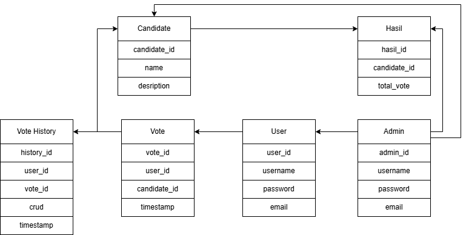
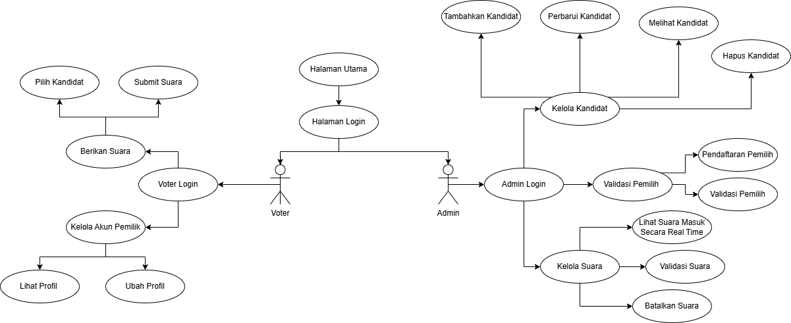

# **Tugas Besar Pemrograman Berbasis Web - Kelompok 13**  
## **Aplikasi Sistem Voting Online**

### **Deskripsi Proyek**

Proyek ini bertujuan untuk membuat aplikasi voting online yang memungkinkan pengguna memberikan suara secara aman dan mudah melalui internet. Aplikasi ini dirancang untuk mendukung berbagai kebutuhan, seperti pemilihan umum, pemungutan suara dalam organisasi, atau pemilihan lainnya yang memerlukan voting secara online.

---

### **Anggota Kelompok**
| Nama | NPM |
| ---- | --- |
| Agil Deriansyah Hasan | 4522210125 |
| Muhammad Harits Fathurrahman | 4520210089 |

---

### **Fitur**

---

#### **Fitur Admin**
- **Dashboard**  
  Menampilkan informasi statistik seperti jumlah kandidat, total pemilih, jumlah suara yang masuk, dan hasil voting secara langsung.
  
- **Kelola Kandidat**  
  Admin dapat menambahkan, melihat, mengedit, dan menghapus data kandidat.

- **Lihat dan Hapus Riwayat Voting**  
  Admin dapat melihat daftar hasil voting sebelumnya dan menghapus riwayat voting jika diperlukan.

- **Pencarian dan Filter**  
  Memungkinkan admin untuk mencari kandidat atau melihat hasil voting berdasarkan filter tertentu.

- **Hasil Voting**  
  Admin dapat melihat hasil voting secara langsung (real-time).

---

#### **Fitur Voter**
- **Voting**  
  Pengguna terdaftar dapat memilih kandidat yang tersedia. Voting hanya bisa dilakukan satu kali untuk setiap sesi pemilihan.

- **Riwayat Voting**  
  Pengguna dapat melihat daftar sesi voting yang telah mereka ikuti.

---

### **ERD/Entity-Relationship Diagram**

---

### **Use Case Diagram**

---

### **Lisensi**
Proyek ini dilisensikan di bawah [MIT License](LICENSE).

---
